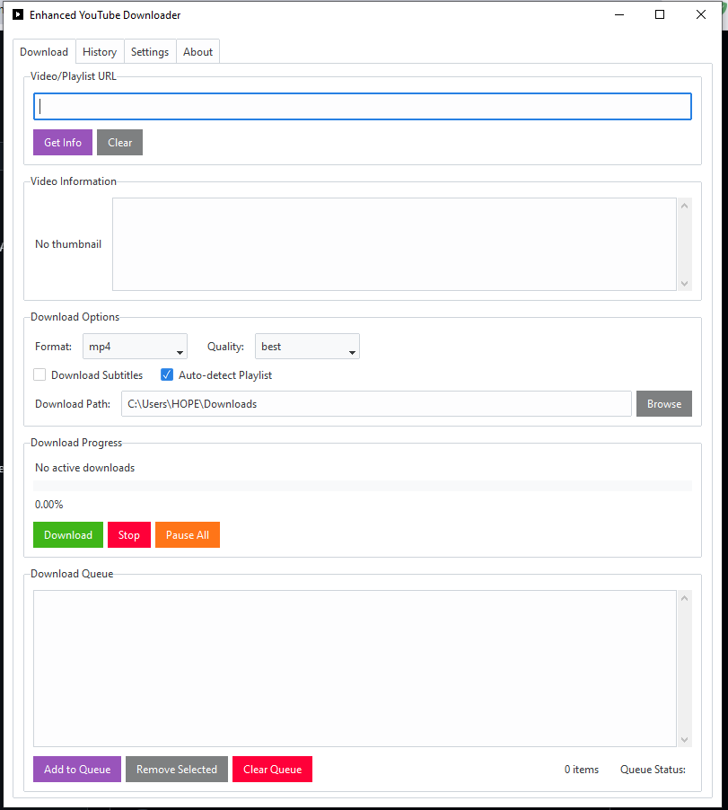

# Enhanced YouTube Video Downloader

A powerful, feature-rich YouTube downloader with modern GUI and advanced functionality.

## Screenshot



## 🚀 Features

### Core Functionality
- **Multiple Format Support**: Download videos in MP4, WebM, MKV formats
- **Audio Extraction**: Extract audio in MP3, AAC, OGG, WAV, M4A formats
- **Quality Selection**: Choose from various video qualities (4K, 1080p, 720p, etc.) and audio bitrates
- **Playlist Support**: Download entire playlists or individual videos from playlists
- **Batch Downloads**: Queue multiple videos for sequential downloading

### User Interface
- **Modern Tabbed Interface**: Organized tabs for Download, History, Settings, and About
- **Theme Support**: Multiple themes with dark/light mode toggle
- **Progress Tracking**: Real-time progress bars with download speed display
- **Drag & Drop**: Simply drag URLs into the application
- **Video Previews**: Thumbnail and metadata display before downloading

### Advanced Features
- **Download History**: Persistent history with search and statistics
- **Queue Management**: Add, remove, and manage download queues
- **Subtitle Support**: Download video subtitles in multiple languages
- **Smart Path Management**: Remember and configure download locations
- **Desktop Notifications**: Get notified when downloads complete
- **Concurrent Downloads**: Download multiple files simultaneously

## 📋 Requirements

- `ttkbootstrap` - Modern GUI framework
- `pydub` - Audio processing
- `plyer` - Desktop notifications
- `yt-dlp` - YouTube downloading engine
- `tkinterdnd2` - Drag and drop support
- `pillow` - Image processing for thumbnails
- `requests` - HTTP requests for thumbnails

## 🛠️ Installation

1. **Clone the repository:**
```bash
git clone https://github.com/zinzied/Youtube-downloader.git
cd Youtube-downloader
```

2. **Install dependencies:**
```bash
pip install -r requirements.txt
```

3. **Run the application:**
```bash
python downloader.py
```

## 📖 Usage Guide

### Basic Download
1. **Enter URL**: Paste or drag a YouTube URL into the input field
2. **Get Info**: Click "Get Info" to preview video details and thumbnail
3. **Select Options**: Choose format, quality, and download path
4. **Download**: Click "Download" to start downloading

### Playlist Downloads
1. **Enter Playlist URL**: Paste a YouTube playlist URL
2. **Enable Auto-detect**: Ensure "Auto-detect Playlist" is checked
3. **Get Info**: Preview playlist information
4. **Add to Queue**: All playlist videos will be added to the download queue
5. **Start Download**: Process the entire queue

### Queue Management
- **Add to Queue**: Add videos without starting download immediately
- **Remove Selected**: Remove specific items from the queue
- **Clear Queue**: Remove all queued items
- **View Status**: Monitor queue progress and item status

### History & Statistics
- **View History**: See all previously downloaded files
- **Search**: Find specific downloads by title
- **File Management**: Open files or their containing folders
- **Statistics**: View download statistics and storage usage

### Settings & Customization
- **Themes**: Choose from multiple visual themes
- **Dark Mode**: Toggle between light and dark appearances
- **Default Paths**: Set preferred download locations
- **Quality Preferences**: Set default video and audio quality
- **Advanced Options**: Configure concurrent downloads and notifications

## 🎯 New Features in v2.0

✅ **Quality Selection & Advanced Settings**
- Comprehensive quality options for video and audio
- Advanced download configuration options
- Smart format detection and recommendations

✅ **Playlist Support**
- Full playlist downloading capability
- Individual video selection from playlists
- Playlist metadata and progress tracking

✅ **Modern UI Redesign with Tabs**
- Clean, organized tabbed interface
- Improved user experience and workflow
- Better space utilization and navigation

✅ **Download History & Metadata**
- Persistent download history with SQLite database
- Rich metadata storage (title, duration, file size, etc.)
- Search and filter capabilities
- Download statistics and analytics

✅ **Theme Toggle**
- Multiple theme options
- Dark/Light mode support
- User preference persistence

## Donations

* If you feel like showing your love and/or appreciation for this project, then how about shouting me a coffee or Milk :)

[](https://buymeacoffee.com/zied)

### 📞 Contact 📞

## 1. 📧 Email: [ziedboughdir@gmail.com](mailto:ziedboughdir@gmail.com)
## 2. 👤 Facebook Page: [fb.com/Ziedb1984](https://www.facebook.com/Ziedb1984/)
## 3. 📲 Telegram: [@Zinzied](https://t.me/Zinzied)


